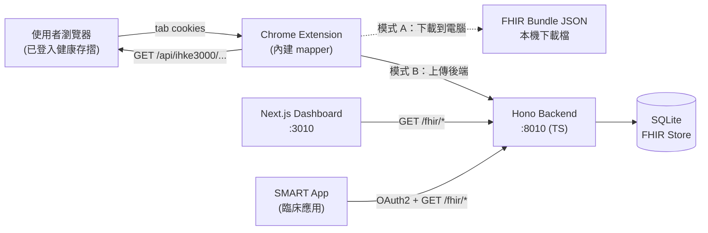

# NHI-FHIR-BRIDGE

[](https://github.com/voho0000/NHI-FHIR-BRIDGE/actions/workflows/backend-ts.yml)
[](https://github.com/voho0000/NHI-FHIR-BRIDGE/actions/workflows/release.yml)
[](LICENSE)

> 把台灣健保署**健康存摺**裡的就醫、用藥、檢驗、影像紀錄，**自動轉成 FHIR R4 標準格式**，讓任何 SMART on FHIR App 都能查得到。

---

> ⚠️ **免責聲明**：本工具**僅供參考**，**無法保證資料完全準確**——NHI 的 JSON 欄位偶有 schema 變動、未涵蓋的 edge case、或 mapper bug 都可能造成輸出與真實情況不一致。臨床判讀或正式用途請**以[健保署健康存摺](https://myhealthbank.nhi.gov.tw/)上顯示的內容為主**；本工具產出的 FHIR 檔僅作為個人備份 / 開發測試 / 跨系統匯入的參考依據。


## 它幫你做什麼？

健保署「健康存摺」(`myhealthbank.nhi.gov.tw`) 雖然存了你看過的所有醫院紀錄，但只能在他們網站上瀏覽，**沒辦法匯出**、**沒有 API**、**無法跟其他系統串接**。

NHI-FHIR-BRIDGE 是一個跑在**你自己電腦上**的工具。有兩種使用方式：

**🟢 模式 A：純 Extension（下載到電腦）**
- 只裝 Chrome 擴充功能，**完全不需要後端**
- 健保存摺資料 → FHIR R4 → 下載成 JSON 檔到電腦
- 適合：個人臨床研究、個人病歷備份、單次匯出
- **PHI 不會離開你的瀏覽器**

**🔵 模式 B：Extension + Backend（上傳後端）**
- Extension + 一行 `docker compose up -d` 起後端 + Dashboard
- 多次同步累積到本地 FHIR Server，Dashboard 瀏覽 / 一鍵 launch SMART App
- 適合：診間多病人累積、SMART App 整合、團隊共用
- **資料一樣只在你/團隊內部電腦**

---

## 系統架構



更詳細的元件設計與資料流程見 [docs/ARCHITECTURE.md](docs/ARCHITECTURE.md)。

---

## 🚀 快速開始

### 🟢 模式 A — 純 Extension（最快，~2 分鐘）

不會程式也能用。完全不需要 Docker / Node / 任何指令。

**1. 下載 Extension**

到 [Releases 頁面](https://github.com/voho0000/NHI-FHIR-BRIDGE/releases/latest)下載最新的
`nhi-fhir-bridge-extension-vX.Y.Z.zip`，解壓到任意位置（例如 `~/nhi-fhir-bridge/`）。

**2. 載入到 Chrome**

1. Chrome 網址列輸入 `chrome://extensions`
2. 右上角開啟「**開發人員模式**」
3. 左上角點「**載入未封裝項目**」
4. 選擇剛解壓出來的 **`dist/` 資料夾**
5. 工具列右上角點 🧩（拼圖）→ 找到 **NHI-FHIR Bridge** → 按 📌 釘到工具列（Chrome 預設不會自動釘）

**3. 設定 + 取得資料**

點工具列圖示。popup 預設「**💾 存到電腦**」模式。

- 在「**病人資料**」卡片填**性別**（必填）+ 出生年份（建議真填）→ 按「✓ 確定」
  - 身分證字號 **不用填**，按下取得時 extension 會自動從健保存摺帶入
  - 姓名／完整生日可以填假
- 開新分頁登入 https://myhealthbank.nhi.gov.tw/（沒登入的話 popup 會跳按鈕帶你過去）
- 回 popup，按「**🔄 取得健保存摺資料**」
- ~15–30 秒（看 NHI 速度）後 popup 出現「**📥 下載健康紀錄檔**」按鈕 → 按它把檔案存到電腦
- 檔名範例：`nhi-P12345XXXX-20250517-20260517.json`
  - `P12345****` ＝ 身分證後 4 碼半遮罩（避免下載夾被瞄到，檔案內容仍是真實值）
  - `20250517-20260517` ＝ 這次抓的健保資料區間（起–訖日）

✅ 完成。檔案就是符合 FHIR R4 標準的 Bundle，可丟給任何能讀 FHIR 的軟體。

---

### 🔵 模式 B — Extension + Backend（多了 dashboard / SMART app）

如果你需要：
- 把多次同步**累積在本地 FHIR Server**
- 用 **Dashboard** 看多個病人
- 一鍵 launch **SMART on FHIR App** 看資料

那加跑後端。多兩步：

**前置需要**：[安裝 Docker Desktop](https://docs.docker.com/get-docker/)

**1. 取得程式碼 + 啟動後端**

```bash
git clone https://github.com/voho0000/NHI-FHIR-BRIDGE.git
cd NHI-FHIR-BRIDGE
docker compose up -d
```

第一次 build 約 1–2 分鐘。跑起來後：

| 服務 | 網址 |
|------|------|
| Dashboard | http://localhost:3010 |
| 後端 FHIR API | http://localhost:8010 |

**2. 切換 Extension 模式**

Extension popup → 上方「輸出方式」改成「**上傳後端**」即可。Backend URL
預設 `http://localhost:8010` 不用改；自架其他位置（例如 `http://192.168.1.100:8010`）就到「⚙️ 進階設定」填新的 URL，
第一次 Chrome 會跳出權限對話框，按「允許」就好。

popup 最上方會出現綠色「**🟢 已連線**」banner — 沒有 banner 不要按 sync，
表示 backend 還沒起來或設定錯了，banner 會直接告訴你原因（例如「請執行 `docker compose up -d`」）。

之後流程跟模式 A 一樣，差別在：
- 資料**也會**寫到 backend 的 FHIR Store（Dashboard 立刻看到新增的 Patient）
- 同時還是會產生一個下載按鈕 — 內容是 backend 目前累積的完整 Bundle（這次 + 過往）

`http://localhost:3010` 打開 Dashboard 可以多病人瀏覽 + 一鍵 launch SMART App。

---

### Step 詳細說明（模式共用）

#### 病人資料卡

點工具列的擴充功能圖示，展開「**病人資料**」區塊：

| 欄位 | 必填 | 說明 |
|------|------|------|
| 性別 | ✅ | male / female / other —— 寫進 FHIR `Patient.gender`，後端 / SMART App 判讀檢驗值參考區間會用到 |
| 出生年份 | ❌ | 建議填真實年份（年齡會影響檢驗值判讀區間） |
| 身分證字號 | — | **不用填**，按下「取得」時 extension 會自動從健保存摺帶入；popup 顯示時會半遮罩成 `P12345****` |
| 姓名 | ❌ | 可填假；要在多病人 / 教學場景遮罩，到「⚙️ 進階設定 → 對外輸出時遮罩病人姓名」打開 |
| 完整生日 | ❌ | 可填假（只有出生年會影響檢驗值區間） |

按「**儲存資料**」。資料只存在你的瀏覽器本機 (`chrome.storage.local`，**不會同步到 Google 帳號**)，**不會傳出去**。

#### 登入健康存摺

新分頁開 https://myhealthbank.nhi.gov.tw/，用健保卡 + 註冊密碼登入。

#### Backend 模式專屬：看資料 / 啟動 SMART App

打開 http://localhost:3010，Dashboard 會列出 FHIR Patient。每個 Patient 卡片下面：

| 按鈕 | 功能 |
|------|------|
| 📦 **Export** | 把這位病人的所有 FHIR 資源下載成單一 JSON Bundle |
| 🚀 **Launch** | 開內建的 demo SMART App 查看這位病人的紀錄 |
| 🗑️ **Delete** | 清掉這位病人的所有資料（重新同步前用） |

點「🚀 Launch」會在新分頁開啟 SMART on FHIR App，自動帶這位病人的 context。

---

## 進階：使用自架 SMART App

擴充功能 popup → **「⚙️ 進階設定」** → **「SMART App Launch URL」** 填入你的 URL 即可：

```
https://your-smart-app.example.com/launch
```

**不需要改後端任何設定。** FHIR / SMART discovery 端點預設對所有 origin 開放（符合 SMART on FHIR App Launch IG §3.1）。PHI 端點仍由 OAuth2 token 保護。

詳見 [docs/ARCHITECTURE.md — CORS 雙層設計](docs/ARCHITECTURE.md#cors-雙層設計)。

---

## 環境變數參考

完整變數列表（**所有都選填，本機開發直接 `docker compose up -d` 即可**）：

| 變數 | 預設 | 用途 |
|------|------|------|
| `SYNC_API_KEY` | (空) | 保護所有 PHI 端點 (`/sync/*`、`/fhir/*`、`/smart/launch-context`、`/fhir/import`、`/fhir/export`)。**任何網路可達的部署必設**；空值時後端會印 console 警告 |
| `ALLOWED_EXTENSION_IDS` | (空) | 允許走 CORS 的 chrome-extension ID（逗號分隔）。Production 部署建議只放發佈用的 ID |
| `BIND_HOST` | `127.0.0.1` | 本機綁定 host。對 LAN 開放才需要設成 `0.0.0.0`（Docker compose 自動處理） |
| `ALLOW_CORS_ORIGINS` | (空) | 額外允許的 CORS origin（逗號分隔） |
| `FHIR_BASE_URL` | `http://localhost:8010/fhir` | 對外公開的 FHIR base URL（SMART CapabilityStatement 會用到） |

需要時 `cp .env.example .env` 編輯即可。

---

## 常見問題

### Q1: Dashboard 顯示 `Failed to fetch`

Backend 沒跑起來。

```bash
# 看 backend 健康狀態
docker compose ps
docker compose logs --tail=50 backend

# 確認 port 8010 通
curl http://localhost:8010/
```

### Q2: 同步完顯示「已更新 0 筆健康紀錄」

最常見的兩種原因：

1. **沒填身分證字號**：popup 上方「病人資料」要填 `id_no`
2. **日期範圍裡沒看病**：把 popup 的「日期範圍」拉長（例如全部歷史紀錄）再試

如果還是 0，看 backend log：

```bash
docker compose logs --tail=100 backend | grep -E "upload-structured|ERROR"
```

### Q3: Launch SMART App 卡在「Launching SMART…」

如果是預設的 demo SMART app (voho0000.github.io)：可能 GitHub Pages 暫時無法存取，等一下再試。

如果是自架 SMART App：打開 SMART App 那個 tab 的 DevTools Console 看錯誤訊息。最常見的是 SMART App 自己的 OAuth2 redirect_uri 沒在後端註冊（這需要改 backend code 註冊新 client_id）。

### Q4: 我可以同步別人的健保存摺嗎？

**不可以**。你只能登入你自己的 NHI 帳號、同步你自己的健康存摺。

### Q5: 我的資料會被傳到哪裡？

- ✅ 健保存摺 → 你電腦上的擴充功能 → 你電腦上的 backend → 你電腦上的 SQLite
- ✅ **沒有 AI、沒有 LLM、沒有任何第三方 API 呼叫**
- ✅ FHIR 轉換是純確定性程式碼（packages/mapper）

這個專案有意完全不整合 AI／LLM —— PHI 永遠不離開你機器。

### Q6: 如果想清空所有資料重來？

Backend 模式（SQLite 跑在 Docker 內部 named volume）：

```bash
docker compose down -v          # -v 連 named volume 一起刪
docker compose up -d
```

純 Extension 模式（沒 backend）：popup 上的「🗑️ 清除待下載檔案」按鈕清掉
chrome.storage 裡的暫存 Bundle；下次 sync 會重新產生。Extension 自己沒長期儲存資料。

### Q7: 為什麼 popup 上面顯示「✗ 連不上後端」？

「上傳後端」模式才會看到這個 banner。最常見原因：

1. **Backend 沒啟動** → 執行 `docker compose up -d`
2. **URL 設錯** → 看「⚙️ 進階設定 → Backend URL」是不是指對地方
3. **Chrome 沒給跨來源權限**（自架 server 時）→ 重新開 popup，當權限對話框跳出時按「允許」
4. **5 秒逾時** → backend 剛啟動還在 migration，等 30 秒再按 banner 上的「重試」

---

## 功能特色細節

### NHI 頁面支援

| IHKE 頁面代碼 | 內容 | 產出 FHIR 資源 |
|---------------|------|----------------|
| IHKE3101S01 | 個人基本資料 | `Patient` |
| IHKE3306S01/S02 | 藥品醫囑 | `MedicationRequest` |
| IHKE3303S02 | 就醫紀錄 | `Encounter` |
| IHKE3401S01/S02 | 檢驗檢查 | `DiagnosticReport` + `Observation` |
| IHKE3202S01 | 藥物過敏 | `AllergyIntolerance` |
| IHKE3301S05 | 手術醫療程序 | `Procedure` |
| IHKE3408S01/S02 | 影像檢查 | `DiagnosticReport` |
| IHKE3402/3404S01 | 成人/癌症篩檢 | `Observation` |

### 檢驗報告分組邏輯

健康存摺把檢驗結果以扁平清單呈現，每筆都帶**醫令代碼**（例 `08013C` = CBC、`06013C` = 尿液常規）。本工具：

1. 依 `(醫令代碼, 日期, 醫院)` 分組 → 每組產生一份 `DiagnosticReport`
2. 用內建 200+ 條 `NHI_TO_LOINC` 對照表，把每個項目代碼對應到 LOINC
3. **去重**：健康存摺常把同一筆檢驗以中英文各列一次（例 `醣化血紅素 5.9%` + `HbA1c 5.9%`），自動合併

### 不使用 AI / LLM

刻意設計：每個支援的 NHI 頁面都有穩定的 JSON 端點，extension 在瀏覽器內直接呼叫並進行確定性的 FHIR 轉換。沒有 AI、沒有 prompt engineering、沒有送 PHI 到雲端的疑慮。也減少了 ~600 LOC 程式 + Anthropic SDK / cheerio / Ollama 依賴。NHI 真的改 API 時，這個專案會直接壞掉，靠社群 PR 修 endpoint 對應；不會偷偷把 PHI 送出去當 fallback。

---

## 隱私與安全

- ✅ Backend 與 Dashboard 預設綁定 `127.0.0.1`（loopback only），LAN 上其他機器無法存取
- ✅ Chrome 擴充功能完全運作於你自己的瀏覽器 session，**不儲存任何登入憑證**
- ✅ 健保存摺資料屬於敏感個資（PHI），請遵守《個人資料保護法》
- ⚠️ Production 部署務必設一個強隨機 `SYNC_API_KEY`
- ⚠️ Dashboard 預設無認證，多人使用需自行加 SSO / Reverse Proxy

---

## 已知限制

- 增量同步使用 SHA-256 page hash 跳過未變動的頁面，但目前還沒有完整 delta query（每次同步重抓全部頁面）
- SMART token 的資源過濾預設只套用在 `Patient` 資源
- 健保署若刪除某些紀錄，本地 FHIR store 不會自動移除

---

## 專案結構

```
NHI-FHIR-BRIDGE/                     # npm workspaces monorepo
├── packages/
│   └── mapper/                      # @nhi-fhir-bridge/mapper —
│       └── src/                     #   NHI → FHIR R4 pure mapping
│                                    #   logic, 同時給 backend + extension import
├── backend-ts/                      # Hono 後端 (TypeScript)
│   ├── src/
│   │   ├── api/                     # /fhir /smart /sync routes
│   │   ├── core/                    # config, database, security, migrate
│   │   ├── fhir/                    # FHIR store, CapabilityStatement
│   │   ├── smart/                   # SMART OAuth2 + PKCE
│   │   └── main.ts                  # Hono app + CORS + lifespan
│   ├── drizzle/                     # SQL migration (idempotent)
│   └── tests/                       # vitest 單元測試
├── extension/                       # Chrome MV3 擴充功能
│   ├── src/                         # 開發 source
│   ├── dist/                        # build 產出（commit 進 git，user 直接 load）
│   └── build.mjs                    # esbuild 打包腳本
├── frontend/                        # Next.js Dashboard
├── docs/                            # 架構文件
├── docker-compose.yml               # backend-ts + frontend
├── docker-compose.python.yml        # 舊 Python backend（保留參考用）
└── .env.example
```

### 開發者：從 source 跑 / 改 code

```bash
git clone https://github.com/voho0000/NHI-FHIR-BRIDGE.git
cd NHI-FHIR-BRIDGE
npm install                          # 安裝 workspaces 全部依賴

# Backend
docker compose up -d                 # 跑 backend + dashboard
# 或本機直跑：
cd backend-ts && npm run dev

# Extension（改完 src/ 要重 build）
npm run build:extension              # 從 repo root 跑
# 或開發 watch mode：
cd extension && npm run dev

# 然後 chrome://extensions → 重新整理 ⟳ extension 卡片
```

---

## 開發 / 貢獻

歡迎 Pull Request！詳細開發流程、PR checklist、跑測試與 lint 指令請見 [CONTRIBUTING.md](CONTRIBUTING.md)。

重大改動請先開 Issue 討論。

---

## 授權

Apache License 2.0 — 詳見 [LICENSE](LICENSE)。

---

## 致謝

- [HL7 FHIR R4](https://hl7.org/fhir/R4/)
- [SMART on FHIR App Launch IG](http://hl7.org/fhir/smart-app-launch/)
- [TWNHIFHIR Implementation Guide](https://build.fhir.org/ig/TWNHIFHIR/pas/)
- 健保署「健康存摺」(`myhealthbank.nhi.gov.tw`)
