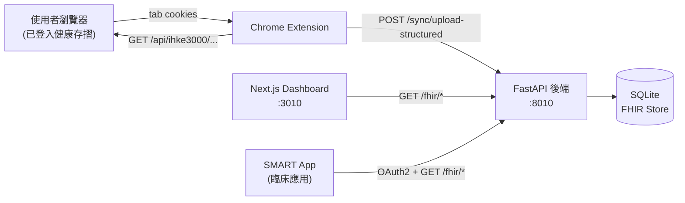

# NHI-FHIR-BRIDGE

[](https://github.com/voho0000/NHI-FHIR-BRIDGE/actions/workflows/test.yml)
[](https://github.com/voho0000/NHI-FHIR-BRIDGE/actions/workflows/lint.yml)
[](LICENSE)

> 把台灣健保署**健康存摺**裡的就醫、用藥、檢驗、影像紀錄，**自動轉成 FHIR R4 標準格式**，讓任何 SMART on FHIR App 都能查得到。

---

## 它幫你做什麼？

健保署「健康存摺」(`myhealthbank.nhi.gov.tw`) 雖然存了你看過的所有醫院紀錄，但只能在他們網站上瀏覽，**沒辦法匯出**、**沒有 API**、**無法跟其他系統串接**。

NHI-FHIR-BRIDGE 是一個跑在**你自己電腦上**的工具，可以：

- ✅ 一鍵把健康存摺裡的資料**同步到符合國際標準 FHIR R4** 的本地資料庫
- ✅ 透過 Dashboard 把任一病人的資料**匯出成 FHIR Bundle JSON**
- ✅ 用內建的 **SMART on FHIR App** 查看資料，或串接你自己/別人寫的 SMART App
- ✅ **不需要任何 API key**（預設 API 直連模式不用 LLM）
- ✅ **資料不離開你的電腦**（除非你選擇啟用 LLM fallback）

---

## 系統架構



更詳細的元件設計與資料流程見 [docs/ARCHITECTURE.md](docs/ARCHITECTURE.md)。

---

## 🚀 快速開始（首次安裝約 10 分鐘）

### 你需要

- Docker + Docker Compose（[安裝指南](https://docs.docker.com/get-docker/)）
- Chrome 瀏覽器
- 健保卡 + 註冊密碼 / 自然人憑證（登入健康存摺用）
- Python 3（產生 SECRET_KEY 用，Mac 內建）

---

### Step 1：取得程式碼

```bash
git clone https://github.com/voho0000/NHI-FHIR-BRIDGE.git
cd NHI-FHIR-BRIDGE
```

---

### Step 2：產生並設定 SECRET_KEY ⚠️ **必做**

```bash
# 複製環境變數範本
cp .env.example .env

# 產生隨機 SECRET_KEY
python3 -c 'import secrets; print(secrets.token_urlsafe(48))'
```

第二個指令會輸出一串隨機字串，類似：

```
xR8K_3pZv-fY7nQwL9mTbU5jH2cAdGnEoR1sVxM6yB
```

**打開 `.env` 檔案，把這串貼到 `SECRET_KEY=` 後面**，例如：

```bash
SECRET_KEY=xR8K_3pZv-fY7nQwL9mTbU5jH2cAdGnEoR1sVxM6yB
```

> **為什麼必填？** 後端用這個 key 簽 JWT (SMART on FHIR 流程需要)。**沒設或少於 32 字元 backend 會直接拒絕啟動**，這是故意的，避免你用預設值跑 production 出意外。
>
> 其他 LLM / Ollama 等變數**都是選填**，預設模式不會用到。

---

### Step 3：啟動服務

```bash
docker compose up --build
```

第一次 build 大約 1–2 分鐘。完成後你會看到：

```
backend-1  | INFO  [alembic.runtime.migration] Running upgrade -> ...
backend-1  | INFO:     Uvicorn running on http://0.0.0.0:8010
frontend-1 | ✓ Ready in 1.4s
```

服務跑起來後：

| 服務 | 網址 |
|------|------|
| Dashboard | http://localhost:3010 |
| 後端 FHIR API | http://localhost:8010 |
| API 文件 (Swagger) | http://localhost:8010/docs |

---

### Step 4：載入 Chrome 擴充功能

1. Chrome 網址列輸入 `chrome://extensions`
2. 右上角開啟「**開發人員模式**」
3. 左上角點「**載入未封裝項目**」
4. 選擇 NHI-FHIR-BRIDGE 資料夾裡的 **`extension/` 子資料夾**
5. 工具列出現 🏥 **NHI-FHIR Bridge** 圖示

---

### Step 5：填入身分證字號

點工具列的擴充功能圖示，會跳出 popup。展開「**病人資料**」區塊：

| 欄位 | 必填 | 範例 |
|------|------|------|
| 身分證字號 | ✅ | A123456789 |
| 姓名 | ❌ | 王小明 |
| 生日 | ❌ | 1980-05-15 |
| 性別 | ❌ | male / female |

點「儲存」。資料只存在你的瀏覽器本機 (`chrome.storage.sync`)，**不會傳出去**。

> **為什麼要手動填？** 健康存摺的個人資料頁通常用圖片渲染身分證號，程式無法可靠地抓出來。手動填一次就好，之後同步都會用這個。

---

### Step 6：登入健康存摺

新分頁開 https://myhealthbank.nhi.gov.tw/，用健保卡 + 註冊密碼登入。

---

### Step 7：開始同步！

回到擴充功能 popup，下面有個大綠按鈕：

```
📥 同步健保存摺資料
```

按下去。擴充功能會平行打 NHI 的 13+ 個 JSON API endpoint，把資料丟給後端 mapper。**通常 10–30 秒完成**，看你的病歷量。

進度會即時顯示在 popup 裡。途中可以關掉 popup，背景會繼續跑。

---

### Step 8：看資料

打開 http://localhost:3010，Dashboard 會列出你的 FHIR Patient。每個 Patient 卡片下面：

| 按鈕 | 功能 |
|------|------|
| 📦 **Export** | 把這位病人的所有 FHIR 資源下載成單一 JSON Bundle |
| 🚀 **Launch** | 開內建的 demo SMART App 查看這位病人的紀錄 |
| 🗑️ **Delete** | 清掉這位病人的所有資料（重新同步前用） |

點「🚀 Launch」會在新分頁開啟 SMART on FHIR App，自動帶這位病人的 context。

---

## 進階：使用自架 SMART App

擴充功能 popup → **「⚙️ 進階設定」** → **「SMART App Launch URL」** 填入你的 URL 即可：

```
https://your-smart-app.example.com/launch
```

**不需要改後端任何設定。** FHIR / SMART discovery 端點預設對所有 origin 開放（符合 SMART on FHIR App Launch IG §3.1）。PHI 端點仍由 OAuth2 token 保護。

詳見 [docs/ARCHITECTURE.md — CORS 雙層設計](docs/ARCHITECTURE.md#cors-雙層設計)。

---

## 環境變數參考

`.env` 完整可用變數，**只有 `SECRET_KEY` 必填**：

| 變數 | 必填 | 預設 | 說明 |
|------|------|------|------|
| `SECRET_KEY` | ✅ | — | JWT 簽章金鑰，至少 32 字元 |
| `SYNC_API_KEY` | ❌ | (空) | `/sync/*` API 認證 key。**production 強烈建議設**，否則任何能連到 backend 的人都能寫資料 |
| `ALLOW_CORS_ORIGINS` | ❌ | (空) | 額外允許的 CORS origin（逗號分隔），追加到內建白名單 |
| `FHIR_BASE_URL` | ❌ | `http://localhost:8010/fhir` | 對外公開的 FHIR base URL（SMART CapabilityStatement 會用到） |
| `LLM_PROVIDER` | ❌ | `claude` | 只在 HTML fallback 路徑用到 |
| `ANTHROPIC_API_KEY` | ❌ | — | 上面 `=claude` 時填 |
| `OLLAMA_BASE_URL` | ❌ | `http://host.docker.internal:11434` | 上面 `=ollama` 時 |
| `OLLAMA_MODEL` | ❌ | `qwen2.5vl:7b` | Ollama 模型名 |

---

## 常見問題

### Q1: backend log 顯示 `SECRET_KEY must be at least 32 characters`

你 `.env` 沒設或字串太短。執行：

```bash
python3 -c 'import secrets; print(secrets.token_urlsafe(48))'
```

把輸出貼到 `.env` 的 `SECRET_KEY=` 後面，重啟：

```bash
docker compose restart backend
```

### Q2: Dashboard 顯示 `Failed to fetch`

Backend 沒跑起來。

```bash
# 看 backend 健康狀態
docker compose ps
docker compose logs --tail=50 backend

# 確認 port 8010 通
curl http://localhost:8010/
```

### Q3: 同步完顯示「已更新 0 筆健康紀錄」

最常見的兩種原因：

1. **沒填身分證字號**：popup 上方「病人資料」要填 `id_no`
2. **同步範圍裡沒看病**：把「同步範圍」改成「全部歷史紀錄」再試

如果還是 0，看 backend log：

```bash
docker compose logs --tail=100 backend | grep -E "upload-structured|ERROR"
```

### Q4: Launch SMART App 卡在「Launching SMART…」

如果是預設的 demo SMART app (voho0000.github.io)：可能 GitHub Pages 暫時無法存取，等一下再試。

如果是自架 SMART App：打開 SMART App 那個 tab 的 DevTools Console 看錯誤訊息。最常見的是 SMART App 自己的 OAuth2 redirect_uri 沒在後端註冊（這需要改 backend code 註冊新 client_id）。

### Q5: 我可以同步別人的健保存摺嗎？

**不可以**。你只能登入你自己的 NHI 帳號、同步你自己的健康存摺。

### Q6: 我的資料會被傳到哪裡？

預設 API 直連模式：

- ✅ 健保存摺 → 你電腦上的擴充功能 → 你電腦上的 backend → 你電腦上的 SQLite
- ✅ **沒有任何資料傳到第三方雲端**

只有當你選擇開 LLM fallback（手動改 `.env` + 用 `/sync/upload-html` endpoint）才會用 Claude API 或本機 Ollama。

### Q7: 如果想清空所有資料重來？

```bash
docker compose down
rm -f data/ehr_bridge.db
docker compose up --build
```

---

## 功能特色細節

### NHI 頁面支援

| IHKE 頁面代碼 | 內容 | 產出 FHIR 資源 |
|---------------|------|----------------|
| IHKE3101S01 | 個人基本資料 | `Patient` |
| IHKE3306S01/S02 | 藥品醫囑 | `MedicationRequest` |
| IHKE3303S02 | 就醫紀錄 | `Encounter` |
| IHKE3401S01/S02 | 檢驗檢查 | `DiagnosticReport` + `Observation` |
| IHKE3202S01 | 藥物過敏 | `AllergyIntolerance` |
| IHKE3301S05 | 手術醫療程序 | `Procedure` |
| IHKE3408S01/S02 | 影像檢查 | `DiagnosticReport` |
| IHKE3402/3404S01 | 成人/癌症篩檢 | `Observation` |

### 檢驗報告分組邏輯

健康存摺把檢驗結果以扁平清單呈現，每筆都帶**醫令代碼**（例 `08013C` = CBC、`06013C` = 尿液常規）。本工具：

1. 依 `(醫令代碼, 日期, 醫院)` 分組 → 每組產生一份 `DiagnosticReport`
2. 用內建 200+ 條 `NHI_TO_LOINC` 對照表，把每個項目代碼對應到 LOINC
3. **去重**：健康存摺常把同一筆檢驗以中英文各列一次（例 `醣化血紅素 5.9%` + `HbA1c 5.9%`），自動合併

### LLM 備援路徑（預設不用）

當 NHI 改 JSON API 格式時，可以切換到 HTML 擷取 + Claude/Ollama 萃取的備援路徑。設定方式：

```bash
# .env
LLM_PROVIDER=claude
ANTHROPIC_API_KEY=sk-ant-api03-...
# 或本機 Ollama
LLM_PROVIDER=ollama
OLLAMA_MODEL=qwen2.5vl:7b
```

詳見 [docs/ARCHITECTURE.md](docs/ARCHITECTURE.md)。

---

## 隱私與安全

- ✅ Backend 與 Dashboard 預設綁定 `127.0.0.1`（loopback only），LAN 上其他機器無法存取
- ✅ Chrome 擴充功能完全運作於你自己的瀏覽器 session，**不儲存任何登入憑證**
- ✅ 健保存摺資料屬於敏感個資（PHI），請遵守《個人資料保護法》
- ⚠️ Production 部署務必設 `SYNC_API_KEY` 與強隨機 `SECRET_KEY`
- ⚠️ Dashboard 預設無認證，多人使用需自行加 SSO / Reverse Proxy

---

## 已知限制

- 增量同步使用 SHA-256 page hash 跳過未變動的頁面，但目前還沒有完整 delta query（每次同步重抓全部頁面）
- SMART token 的資源過濾預設只套用在 `Patient` 資源
- 健保署若刪除某些紀錄，本地 FHIR store 不會自動移除

---

## 專案結構

```
NHI-FHIR-BRIDGE/
├── backend/                    # FastAPI 後端
│   ├── app/
│   │   ├── api/                # FHIR / SMART / sync endpoints
│   │   ├── core/               # config, database
│   │   ├── fhir/               # FHIR store, CapabilityStatement, code systems
│   │   ├── mapper/             # 8 個 FHIR mappers + LOINC 對照表 + parsers
│   │   ├── smart/              # SMART OAuth2 實作
│   │   └── fallback/           # HTML + LLM 備援路徑 (預設不啟用)
│   ├── alembic/                # DB migration
│   └── tests/                  # pytest 單元 + 整合測試
├── extension/                  # Chrome 擴充功能 (MV3)
├── frontend/                   # Next.js Dashboard
├── docs/                       # 架構文件
├── docker-compose.yml
└── .env.example
```

---

## 開發 / 貢獻

歡迎 Pull Request！詳細開發流程、PR checklist、跑測試與 lint 指令請見 [CONTRIBUTING.md](CONTRIBUTING.md)。

重大改動請先開 Issue 討論。

---

## 授權

MIT License — 詳見 [LICENSE](LICENSE)。

---

## 致謝

- [HL7 FHIR R4](https://hl7.org/fhir/R4/)
- [SMART on FHIR App Launch IG](http://hl7.org/fhir/smart-app-launch/)
- [TWNHIFHIR Implementation Guide](https://build.fhir.org/ig/TWNHIFHIR/pas/)
- 健保署「健康存摺」(`myhealthbank.nhi.gov.tw`)
