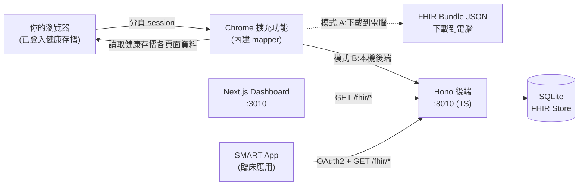

# NHI-FHIR Bridge

[](https://github.com/voho0000/NHI-FHIR-BRIDGE/actions/workflows/backend-ts.yml)
[](https://github.com/voho0000/NHI-FHIR-BRIDGE/actions/workflows/release.yml)
[](LICENSE)

> 把台灣健保署「**健康存摺**」的就醫、用藥、檢驗、影像紀錄,在**你自己的瀏覽器內**一鍵轉成 **HL7 FHIR R4** 國際標準格式 —— 預設下載成 JSON 檔到你的電腦,也可選擇匯入任何讀得懂 FHIR 的工具或 SMART on FHIR App。

健康存摺存了你所有的就醫紀錄,卻**只能在官網瀏覽、不能匯出、沒有 API**。這個工具把它變成標準、可攜、可程式化的 FHIR 資料 —— 而且**全程在本機處理,不上雲、不接 AI、不收任何資料**。

---

> 🏛️ **非官方產品**:本專案是獨立開源工具,**並非**衛生福利部中央健康保險署(健保署)、衛生福利部或任何政府機關的官方產品,**亦未經其背書或審核**。「健康存摺」「NHI」等名稱僅用於描述本工具所處理的資料來源。
>
> ⚠️ **免責聲明**:本工具**僅供參考,無法保證資料完全準確** —— NHI 的 JSON 偶有 schema 變動、未涵蓋的 edge case、或對應 bug 都可能造成落差。臨床判讀或正式用途請**以[健保署健康存摺](https://myhealthbank.nhi.gov.tw/)顯示的內容為主**;本工具產出的 FHIR 檔僅作個人備份 / 開發測試 / 跨系統匯入的參考。
>
> 🔒 **對安全性有疑慮?** 先看 [**給民眾的安全說明**](docs/SECURITY_FOR_USERS.md) —— 不講工程術語,解釋資料路徑、Bridge 不會做的事、內建保護、常見 Q&A。
>
> 🛒 **Chrome Web Store**:**尚未上架**(準備送審中;通過後在此補連結)。目前請從 [GitHub Releases](https://github.com/voho0000/NHI-FHIR-BRIDGE/releases/latest#:~:text=Assets) 下載最新 zip,用「載入未封裝項目」安裝(見下方)。

---

## 兩種用法

| | 🟢 模式 A — 純擴充功能 | 🔵 模式 B — 擴充功能 + 本機後端(進階) |
|---|---|---|
| 安裝 | 只裝 Chrome 擴充功能 | 擴充功能 + 一行 `docker compose up -d` |
| 輸出 | 健康存摺 → FHIR → **下載 JSON 到電腦** | 累積到本機 FHIR Server,用 Dashboard 瀏覽、一鍵 launch SMART App |
| 適合 | 個人備份、研究、單次匯出 | 診間多病人累積、SMART App 整合 |
| 資料去處 | **不離開你的瀏覽器** | **只在你 / 團隊內部的電腦** |
| 需要會 | 完全不用會程式 | 會用 terminal、Docker |

兩種模式的 FHIR 轉換邏輯完全相同(共用 `packages/mapper`),差別只在輸出到「檔案」還是「本機 server」。

---

## 系統架構



詳細元件設計、資料流與安全模型見 [docs/ARCHITECTURE.md](docs/ARCHITECTURE.md)。

---

## 🚀 快速開始

### 🟢 模式 A — 純擴充功能(最快,~2 分鐘)

不會程式也能用,不需要 Docker / Node / 任何指令。

1. **下載擴充功能** —— 到 [Releases](https://github.com/voho0000/NHI-FHIR-BRIDGE/releases/latest#:~:text=Assets) 下載 `nhi-fhir-bridge-extension-vX.Y.Z.zip`,解壓到任意位置。
2. **載入 Chrome** —— `chrome://extensions` → 開「開發人員模式」→「載入未封裝項目」→ 選解壓出來的 **`dist/` 資料夾** → 工具列 🧩 把 **NHI-FHIR Bridge** 釘上來。
3. **取得資料** —— 點工具列圖示,popup 是個四步驟精靈(預設「下載到電腦」):
   - **① 登入** —— 偵測你是否已在健康存摺分頁登入;沒有會帶你過去。
   - **② 您的資料** —— 填**性別 + 生日 + 姓名**(三項必填)→ 按「儲存資料」。身分證**不用填**(取得時自動從健康存摺 session 帶入);要對外遮罩姓名,旁邊有小勾。
   - **③ 取得** —— 按「取得健康存摺資料」。約 40 秒(慢時可達 2 分鐘)後出現「下載健康紀錄檔」。勾「一併下載影像」會多花時間觸發 NHI 備圖;若這次影像還在備製中,過幾分鐘再同步一次即可補齊。
   - **④ 查看(選用)** —— 可用外部工具「醫析 MediPrisma」把檔案拖進去看圖表。⚠️ 該工具的「AI 問答」會把資料送到雲端 AI,**Bridge 本身不接 AI、不上雲**(見[安全說明](docs/SECURITY_FOR_USERS.md))。

下載的檔名範例:`nhi-P12345XXXX-20250517-20260517-vX.Y.Z.json`
(`P12345XXXX` = 身分證後 4 碼遮罩;中間是健保資料區間;`vX.Y.Z` = 產生此檔的 bridge 版本,也寫在 `Bundle.meta.tag`。)

### 🔵 模式 B — 擴充功能 + 本機後端

需要把多次同步累積到本機 FHIR Server、用 Dashboard 看多病人、或一鍵 launch SMART App 時才需要。前置:[安裝 Docker](https://docs.docker.com/get-docker/)。

```bash
git clone https://github.com/voho0000/NHI-FHIR-BRIDGE.git
cd NHI-FHIR-BRIDGE
docker compose up -d
```

| 服務 | 網址 |
|------|------|
| Dashboard | http://localhost:3010 |
| 後端 FHIR API | http://localhost:8010 |

擴充功能 popup → 右上 **⚙️ 進階設定** → 勾「**啟用本機伺服器模式**」(Chrome 會跳權限視窗要求存取 `localhost`,按「允許」)。回到精靈後第 ③ 步多出「下載到電腦 / 本機伺服器」切換。popup 上方出現綠色「🟢 已連線」才表示後端就緒;沒有 banner 別按同步 —— banner 會直接告訴你原因。

之後同步會**同時**寫進後端 FHIR Store(Dashboard 立刻看到)並產生下載按鈕。Dashboard 每個病人可 **Export**(下載完整 Bundle)/ **Launch**(走完整 SMART on FHIR OAuth2 開啟 SMART App)/ **Delete**。

> ⚠️ 外部(非 localhost)SMART App —— 包含 GitHub Pages 上的 demo「醫析 MediPrisma」—— 需後端先設 `SYNC_API_KEY` 才拿得到 CORS(v0.18.4+);未設 key 時 CORS 鎖在 loopback。自架 SMART App 在進階設定填「SMART App Launch URL」(必須 `https://` 或本機 `http://localhost`)。

---

## 產出哪些 FHIR 資源

擴充功能在瀏覽器內直接讀取健康存摺各頁面的結構化資料,並做**確定性**的 FHIR 轉換:

| 健康存摺資料 | 產出 FHIR 資源 |
|---|---|
| 個人基本資料 | `Patient` |
| 就醫紀錄(西醫門診 / 急診 / 藥局) | `Encounter`(雙維度 type:kind + channel;急診依處置碼判 EMER) |
| 住院 + 住院手術 | `Encounter` (IMP) + `Procedure`(ICD-10-PCS,主/次以 `partOf` 串接) |
| 藥品醫囑 | `MedicationRequest`(依申報型別掛到對應就醫) |
| 慢性處方箋 | `MedicationRequest`(`courseOfTherapyType=continuous`) |
| 檢驗檢查 | `DiagnosticReport` + `Observation`(含判讀校正;依採檢日掛就醫) |
| 影像檢查(報告 + JPG) | `DiagnosticReport`(可選下載影像 frames) |
| 手術 / 處置 | `Procedure`(NHI 醫令碼 + ICD-10-PCS) |
| 藥物過敏 | `AllergyIntolerance` |
| 預防接種 | `Immunization` |
| 重大傷病 | `Condition` |
| 成人 / 癌症篩檢 | `Observation` |

**檢驗分組**:健康存摺把檢驗以扁平清單呈現,每筆帶醫令碼。Bridge 依 `(醫令碼, 日期, 醫院)` 分組成 `DiagnosticReport`,用多層對照規則(`NHI_TO_LOINC` 直對 + `PANEL_LOINC_MAP` panel 子項 + `LOINC_MAP` 顯示名,合計 200+ 條規則)對應 LOINC,並自動合併中英文重複列(如 `醣化血紅素 5.9%` + `HbA1c 5.9%`)。

對接 SMART App 開發者:`Encounter.type` 契約見 [SMART_APP_INTEGRATION_v0.9.2.md](docs/SMART_APP_INTEGRATION_v0.9.2.md);最新消費端變更見 [SMART_APP_CHANGES_v0.20.md](docs/SMART_APP_CHANGES_v0.20.md)。

---

## 🔒 隱私與安全

**核心保證**:健康資料只在你的瀏覽器內處理 —— 不傳到開發者伺服器、不接任何 AI / LLM、不收 telemetry。FHIR 轉換是純規則程式碼(`packages/mapper`),沒有任何雲端 fallback。

- **擴充功能** —— 不接觸登入憑證;暫存 bundle 只在 `chrome.storage.local`(僅本機,不同步 Google 帳號),於「下載完成 / 手動清除 / 1 小時 TTL / 下次同步覆寫」先到者清除;嚴格檢查 `sender.id` 拒絕其他擴充功能;下載一律走「另存新檔」對話框。
- **後端(模式 B)** —— 預設綁 `127.0.0.1`(LAN 不可達);Dashboard 防 CSRF + 驗 Host(防 DNS rebinding);設 `SYNC_API_KEY` 後 PHI 端點走 SMART OAuth2 + PKCE。⚠️ 未設 key 時任何本機程式都能讀寫(單機自用的已知限制),**多人 / 網路部署必設一個強隨機 key**。
- **去識別化**(v0.18.4+)—— 開啟後 `Patient.id` 由半遮身分證派生,無法暴力還原全碼。未去識別化的 bundle 含完整 PHI,**不應公開散布**。
- **唯一的雲端例外** —— 外部工具「醫析 MediPrisma」的「AI 問答」按鈕會把資料送到雲端 LLM(本機視覺化功能不會)。是否使用該工具由你決定。

完整內容:[給民眾的安全說明](docs/SECURITY_FOR_USERS.md) · [隱私權政策](docs/PRIVACY.md) · [弱點通報](SECURITY.md) · 修補紀錄見 [CHANGELOG.md](CHANGELOG.md)。

> ⚠️ 健康存摺資料屬敏感個資,請遵守《個人資料保護法》妥善保管;你只能擷取自己有權檢視的健保資料(本人,或經健保署眷屬功能同意綁定、目前切換顯示的眷屬)。

---

## 環境變數(模式 B,全部選填)

本機自用直接 `docker compose up -d` 即可,不用設任何變數。需要時 `cp .env.example .env` 編輯:

| 變數 | 預設 | 用途 |
|---|---|---|
| `SYNC_API_KEY` | (空) | 保護所有 PHI 端點。**任何網路可達的部署必設**;外部 SMART App 也需此 key 才拿得到 CORS |
| `ALLOWED_EXTENSION_IDS` | (空) | 允許走 CORS 的 chrome-extension ID(逗號分隔) |
| `BIND_HOST` | `127.0.0.1` | 綁定 host;對 LAN 開放才設 `0.0.0.0` |
| `ALLOW_CORS_ORIGINS` | (空) | 額外允許的 CORS origin |
| `FHIR_BASE_URL` | `http://localhost:8010/fhir` | 對外公開的 FHIR base URL(SMART CapabilityStatement 用) |

---

## 常見問題

- **同步顯示「0 筆」** —— 多半是健康存摺 session 過期(回該分頁重新登入再按一次),或日期範圍裡沒看病(把範圍拉長)。
- **影像沒抓到** —— NHI 備圖需要時間;若提示「部分影像仍在備製中」,過幾分鐘再同步一次即可補齊。
- **模式 B 顯示「連不上本機伺服器」** —— 後端沒起(`docker compose up -d`)、Backend URL 設錯、或剛啟動還在 migration(等 30 秒按「重試」)。
- **能同步別人的健康存摺嗎?** —— 擴充功能一次只擷取「健康存摺目前切換顯示的那個人」的資料。健康存摺有眷屬功能,經對方同意綁定後可在自己帳號裡切換檢視眷屬;若你切到眷屬 A,這次同步就只抓眷屬 A 的資料(不是你+眷屬一起抓)。沒有綁定的他人資料則無法存取。
- **想清空重來** —— 模式 B:`docker compose down -v && docker compose up -d`;模式 A:popup 下載按鈕旁的 🗑️ 清掉暫存。

更多疑難排解見 [docs/ARCHITECTURE.md](docs/ARCHITECTURE.md) 與 [docs/SECURITY_FOR_USERS.md](docs/SECURITY_FOR_USERS.md)。

---

## 專案結構與開發

```
NHI-FHIR-BRIDGE/                 # npm workspaces monorepo
├── packages/mapper/            # @nhi-fhir-bridge/mapper — NHI → FHIR R4 純對應邏輯
│                               #   (backend 與 extension 共用,單一真相)
├── extension/                  # Chrome MV3 擴充功能
│   ├── src/                    #   開發 source(背景 SW + popup)
│   └── dist/                   #   build 產出(commit 進 git,使用者直接 load)
├── backend-ts/                 # Hono 後端 (TypeScript) + SQLite FHIR Store
├── frontend/                   # Next.js Dashboard
├── docs/                       # ARCHITECTURE / PRIVACY / SECURITY_FOR_USERS / SMART_APP_* …
├── demo/                       # synthetic-fhir-bundle.json — 合成示範資料(演講/截圖用)
├── CHANGELOG.md                # 每版改了什麼(民眾友善)
├── CONTRIBUTING.md             # 開發環境、PR checklist
├── DEVELOPMENT_RULES.md        # 不可妥協的工程規範(FHIR R4 稽核、LOINC 查證、測試資料)
├── CODE_OF_CONDUCT.md          # 行為準則 + 禁貼真實 PHI
├── SECURITY.md                 # 弱點通報窗口
└── docker-compose.yml
```

```bash
git clone https://github.com/voho0000/NHI-FHIR-BRIDGE.git
cd NHI-FHIR-BRIDGE && npm install

docker compose up -d            # 後端 + Dashboard(或 cd backend-ts && npm run dev)
npm run build:extension         # 重 build 擴充功能(或 cd extension && npm run dev 開 watch)
# 然後 chrome://extensions → 重新整理擴充功能卡片
```

歡迎 Pull Request —— 開發流程、PR checklist、測試與 lint 指令見 [CONTRIBUTING.md](CONTRIBUTING.md);**改 mapper / FHIR 對應前**請先讀 [DEVELOPMENT_RULES.md](DEVELOPMENT_RULES.md)(FHIR R4 稽核、LOINC 查證、測試資料規則)。重大改動請先開 Issue 討論。

---

## 授權與致謝

Apache License 2.0 —— 見 [LICENSE](LICENSE)。

- [HL7 FHIR R4](https://hl7.org/fhir/R4/) · [SMART on FHIR App Launch IG](http://hl7.org/fhir/smart-app-launch/) · [TWNHIFHIR IG](https://build.fhir.org/ig/TWNHIFHIR/pas/)
- 健保署「健康存摺」(`myhealthbank.nhi.gov.tw`)
