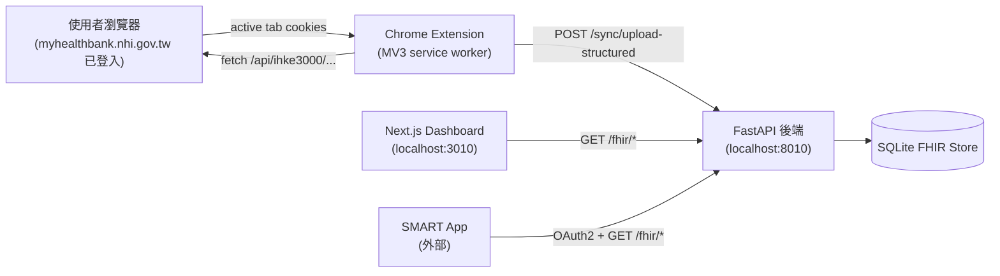
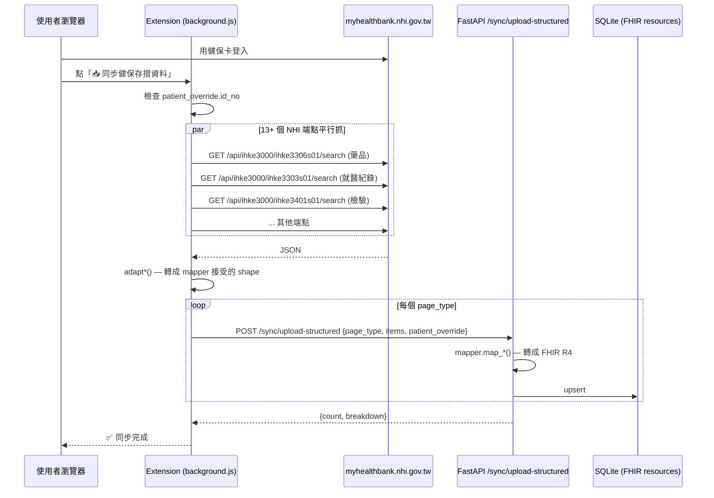
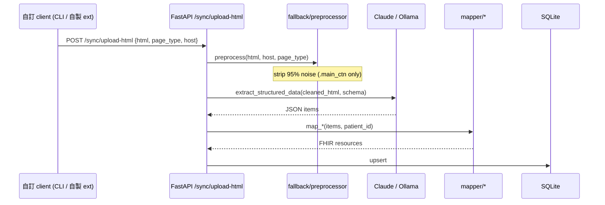

# 系統架構

> 給有意貢獻或閱讀程式碼的人看的高層次設計文件。

---

## 元件總覽



---

## 資料流程：主要同步路徑



關鍵：**主要路徑完全 bypass LLM**。Extension 在瀏覽器端取得結構化 JSON 後，直接餵 mapper。

---

## 資料流程：fallback 路徑（HTML + LLM）



何時觸發 fallback：
- NHI 改 API 格式時的緊急替代方案
- 某些新頁面 NHI 尚未開 JSON 端點
- Debug 用

目前 Chrome Extension 不會自動切到這條路徑——只有手動呼叫 `/sync/upload-html` 才會。

---

## Backend 模組地圖

```
backend/app/
├── api/                FastAPI route 定義
│   ├── fhir.py        # FHIR R4 endpoints (Patient / Observation / ...)
│   ├── smart.py       # SMART on FHIR OAuth2
│   └── sync.py        # /sync/upload-structured + /sync/upload-html
├── core/
│   ├── config.py      # Pydantic Settings + SECRET_KEY 驗證
│   └── database.py    # async engine + Base
├── fhir/
│   ├── server.py      # idempotent upsert by (resourceType, id)
│   ├── capability.py  # /fhir/metadata
│   └── systems.py     # 程式碼系統 URI 常數
├── mapper/             FHIR mapping 核心
│   ├── patient.py、condition.py、allergy.py、procedure.py、encounter.py、
│   │   diagnostic_report.py、medication.py、observation.py
│   ├── _loinc_tables.py    # 大型靜態資料表（純 data，無 logic）
│   └── _parsers.py         # 數值 / 參考範圍 / UCUM 解析
├── models/
│   └── fhir_store.py  # SQLAlchemy ORM
├── smart/
│   └── oauth2.py      # SMART OAuth2 流程
├── fallback/           HTML + LLM 備援路徑（預設不啟用）
│   ├── extractor.py
│   ├── preprocessor.py
│   └── llm/{base.py, claude.py, ollama.py, json_utils.py}
└── main.py            # FastAPI app + lifespan (alembic upgrade head)
```

---

## 為什麼還留著 fallback/?

NHI 健康存摺的 `/api/ihke3000/*` JSON 端點是 SPA 內部 API，沒有公開 API 合約。健保署改版時可能：

1. **改 endpoint 路徑**：例如 `/api/ihke3000/ihke3306s01/search` 改名
2. **改 response 欄位**：JSON 欄位名變動
3. **加上 anti-bot**：CSRF token、rate limit

任一情境發生時，extension 的 API 直連模式會失效。HTML + LLM 路徑作為應急方案，可以用網頁上**仍渲染得出來的內容**繼續服務使用者，直到主路徑修好。

代價：~600 LOC 與 `anthropic` 套件依賴。trade-off 是值得的——比起改版時系統完全壞掉，多帶這些備援程式碼風險低很多。

---

## 資料庫 schema 演進

採 Alembic：

```bash
# 啟動時自動 apply (main.py lifespan 內部跑 alembic upgrade head)
docker compose up

# 手動修 schema
cd backend
# 1. 改 models/fhir_store.py
# 2. 生 migration
alembic revision --autogenerate -m "..."
# 3. apply
alembic upgrade head
```

migration 檔在 `backend/alembic/versions/`，建議在 PR 時 review。

---

## 安全模型

| 介面 | 認證 | CORS | 備註 |
|------|------|------|------|
| `/sync/upload-structured` `/sync/upload-html` | `X-Sync-API-Key` header（可選） | 嚴格 allow list | 預設 `SYNC_API_KEY=""` 為無認證模式，僅供本機開發。production 必填 |
| `/fhir/<resource>`（讀 PHI） | SMART OAuth2 Bearer token | 嚴格 allow list | token 可 patient-scoped |
| `/fhir/metadata` `/smart/.well-known/smart-configuration` | 無（公開 metadata） | **`*` 任何 origin** | SMART App Launch IG §3.1 要求公開；不含 PHI |
| `/smart/authorize` `/smart/token` | OAuth2 標準流程 | 嚴格 allow list | Auth code + PKCE，client_id + redirect_uri 須事先註冊 |
| Dashboard `/` | 無 | 嚴格 allow list | 預設 bind `127.0.0.1` only |

`SECRET_KEY`：必填且 ≥ 32 字元，否則啟動失敗。用於 JWT 簽章。

### CORS 雙層設計

實作上由 `backend/app/main.py` 兩個 layer 組成：

1. **嚴格層** (`CORSMiddleware`)：所有端點預設使用 `_DEFAULT_CORS_ORIGINS` + `ALLOW_CORS_ORIGINS` env var 的合併白名單
2. **公開 metadata 覆寫層**：`public_discovery_cors` middleware 在嚴格層之外另跑一層，攔截 `/fhir/metadata` 與 `/smart/.well-known/smart-configuration` 兩個路徑，回應 `Access-Control-Allow-Origin: *`

這是 SMART on FHIR 業界標準做法（HAPI、Epic、Cerner、SMART Health IT sandbox 都這樣）。詳細安全分析見 GitHub Issues / PR 討論。

**結果**：使用者填入任何自架 SMART App URL 都能正常 launch，**不用改 `.env` 也不用 restart backend**。PHI 端點仍由 Bearer token + OAuth2 redirect-URI 白名單保護，CORS 對 PHI 不是 load-bearing 機制。

---

## 已知設計限制

1. **增量同步**：目前每次同步都重抓所有 page_type，沒有 delta query
2. **多病人**：單一 instance 同時間只支援一位病人同步（透過 `patient_override`）
3. **SQLite**：適合單一機構/單一使用者 POC 部署。多人並行寫入要換 PostgreSQL（`DATABASE_URL` 即可切換）
4. **FHIR 驗證**：已通過 TWNHIFHIR validator 三輪修正（Bundle / UCUM / OID / LOINC / ICD-10-CM / SNOMED），但未整合自動驗證進 CI
