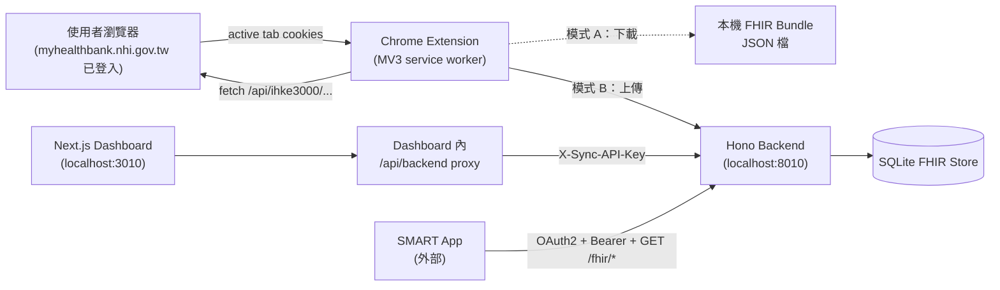
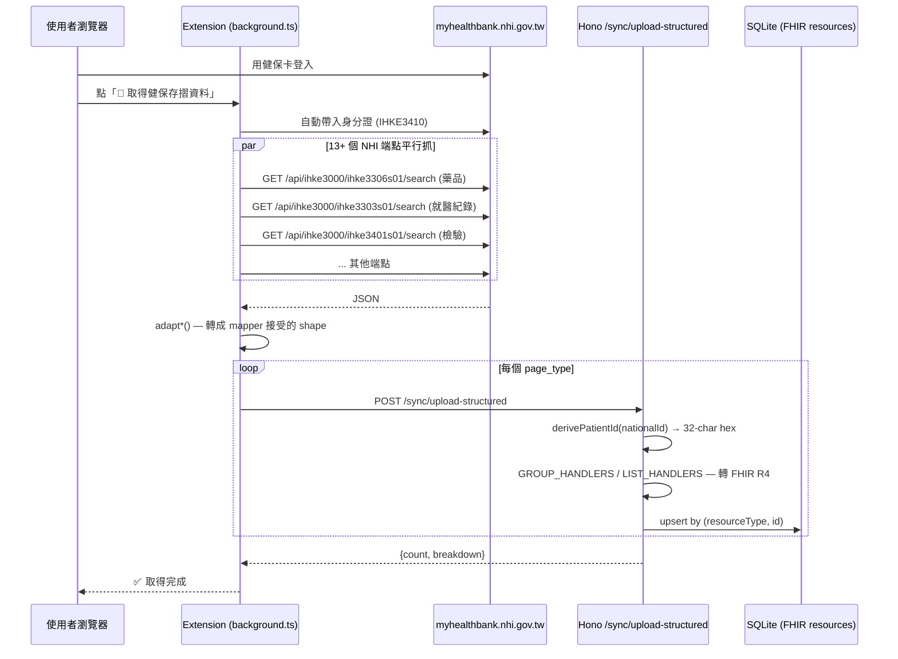

# 系統架構

> 給有意貢獻或閱讀程式碼的人看的高層次設計文件。

---

## 元件總覽



兩種運行模式：

- **模式 A**：extension 全程在瀏覽器內運作，把 NHI 結構化資料轉成 FHIR Bundle JSON 下載到電腦。完全不需要後端
- **模式 B**：除上述外，把 Bundle POST 到本機 Hono 後端，後端寫入 SQLite。Dashboard 顯示多病人、Launch SMART App

---

## Monorepo 結構

```
NHI-FHIR-BRIDGE/                     # npm workspaces
├── packages/
│   └── mapper/                      # @nhi-fhir-bridge/mapper
│       └── src/                     # NHI → FHIR R4 純函式
│                                    #   同時供 backend + extension import
├── backend-ts/                      # Hono 後端 (TypeScript)
│   ├── src/
│   │   ├── api/{fhir,smart,sync}.ts
│   │   ├── core/{config,database,security,migrate}.ts
│   │   ├── fhir/{server,capability,systems}.ts
│   │   ├── smart/oauth2.ts
│   │   ├── models/schema.ts         # Drizzle ORM
│   │   └── main.ts                  # Hono app + CORS + lifespan
│   ├── drizzle/                     # SQL migration
│   └── tests/                       # vitest
├── extension/                       # Chrome MV3 (TypeScript + esbuild)
│   ├── src/
│   │   ├── background.ts            # service worker entry — 組裝 background/ 模組
│   │   ├── background/              # sync-orchestrator / nhi-list-fetch / nhi-detail-fetchers
│   │   │                            #   nhi-imaging-jpeg / backend-upload / auth / badge / …
│   │   ├── popup.html / popup.ts    # extension popup UI entry
│   │   ├── popup/                   # wizard / sync-client / connection / state / …
│   │   ├── nhi-adapters.ts          # pure NHI JSON → normalized shape adapters
│   │   └── nhi-endpoints.ts         # endpoint URL registry + 中文 label map
│   ├── dist/                        # esbuild 輸出（commit 進 repo；CI 驗證與 src 一致）
│   ├── tests/                       # vitest — see extension/tests/README.md
│   └── build.mjs                    # esbuild + Resvg icon render
├── frontend/                        # Next.js Dashboard
│   └── app/
│       ├── api/backend/[...path]/   # server-side proxy with API key
│       ├── page.tsx                 # patient list / export / launch / delete
│       └── layout.tsx, globals.css
├── docker-compose.yml               # backend + frontend
└── .env.example
```

---

## 資料流程：主要同步路徑（模式 B）



**關鍵設計**：

- **完全沒有 AI / LLM**：extension 直接打 NHI 的 JSON 端點取得結構化資料，mapper 是純確定性 TypeScript。PHI 永不送雲端、無 prompt engineering、無 AI 推論不確定性。NHI 真的改 API 時專案會直接壞掉（靠 PR 修），不會偷偷把 PHI 送出去 fallback
- **共用 mapper**：`packages/mapper` 同時被 backend (Hono) 和 extension (service worker) import。模式 A 在 SW 內完成 FHIR 轉換，模式 B 則由後端執行——同一份 mapper 程式碼，輸出相同
- **stableId + 雜湊 Patient.id**：身分證從不出現在 FHIR `Patient.id` 或 `subject.reference`；只存在 `Patient.identifier[].value`。`derivePatientId()` 走純 SHA-1（無 salt），讓 backend 與 extension 對同一個身分證算出相同 `Patient.id`——這是模式 A 下載 Bundle → backend `/fhir/import` 流程要 round-trip 的前提。殘留風險與緩解詳見 [安全模型 §Patient.id 反推風險](#patientid-反推風險與緩解)

---

## 安全模型

| 介面 | 認證 | CORS | 備註 |
|------|------|------|------|
| `/sync/*` (所有) | `X-Sync-API-Key` header | 嚴格 allow list | 包含 `/status`、`/logs`、`/audit-log` 等讀取端點 |
| `/fhir/Patient`、`/fhir/<resource>` | `X-Sync-API-Key` **或** SMART Bearer | 嚴格 allow list | dashboard 走 server proxy 注入 key；SMART app 走 OAuth |
| `/fhir/import`、`/fhir/export` | `X-Sync-API-Key` | 嚴格 allow list | PHI bulk transfer |
| `/fhir/metadata`、`/.well-known/smart-configuration` | 無（公開 metadata） | **`*` 任何 origin** | SMART App Launch IG §3.1 要求；不含 PHI |
| `/smart/authorize` | 須有效 `launch=` token (來自 `/sync/launch-context`) | 嚴格 allow list | 拒絕 standalone-launch；驗證 `aud`；public client 強制 PKCE |
| `/smart/token` | OAuth2 standard | 嚴格 allow list | PKCE verifier check |
| Dashboard `/` | 無（單機 POC） | 嚴格 allow list | 預設 bind `127.0.0.1` |

### 認證流程要點

- **PHI 寫入路徑**（`/sync/upload-*`、`/sync/launch-context`、`/fhir/import`、`/fhir/export`）：靠 `SYNC_API_KEY` header。預設未啟用即所有 auth 旁路（dev 模式），啟動時印 console 警告；正式部署必設
- **PHI 讀取路徑**（`/fhir/*`）：dashboard 透過 Next.js `/api/backend/[...path]` server route 注入 API key，**金鑰永遠不到 browser bundle**；SMART app 透過 OAuth2 Bearer token，token 可 patient-scoped 限制只讀那位病人
- **OAuth2 PKCE**：所有 public client 強制 PKCE；`/smart/authorize` 拒絕無 `launch` token 的 standalone launch（避免自動選第一位病人的 PHI 洩漏漏洞）；驗證 `aud` 確認 SMART app 不是被釣到別的 server
- **opaque token**：access token 是隨機字串，DB membership 即為驗證——沒有 JWT 也沒有 `SECRET_KEY`

### CORS 雙層設計

實作上由 `backend-ts/src/main.ts` 兩個 middleware 層組成：

1. **最外層**：攔截 `/fhir/metadata`、`/smart/.well-known/smart-configuration`、`/fhir/.well-known/smart-configuration`，回應 `Access-Control-Allow-Origin: *`（SMART discovery 業界做法）
2. **嚴格層** (`hono/cors`)：其餘所有端點使用內建白名單 + `ALLOW_CORS_ORIGINS` env 合併。`chrome-extension://` origins 預設只接受 `ALLOWED_EXTENSION_IDS` 內列出的 ID（未設則 fallback 接受任何 32-char [a-p] extension ID，覆蓋 dev install）

PHI 端點仍由 API key + Bearer + OAuth2 redirect-URI 白名單保護；CORS 對 PHI 不是 load-bearing 機制。

### Patient.id 反推風險與緩解

`derivePatientId(rawId)` 是純 `sha1("patient|" + rawId).slice(0, 32)`，**沒有 mix salt**。設計取捨見 [`packages/mapper/src/helpers.ts`](../packages/mapper/src/helpers.ts) 的 source 註解。簡述：

- **跨環境 ID 一致性是 hard requirement**：模式 A 下載的 Bundle 要能 import 進 backend、extension 與 backend 對同一個身分證要算出同一個 `Patient.id`；混入 install-scoped salt 會破壞這個前提（曾考慮過 salt 設計，未實作）。
- **`Patient.identifier[].value` 本就帶 raw 身分證**（FHIR R4 要求）：整份 Bundle leak 時，raw ID 與 hashed ID 一起外流，salt 對「Bundle leak」這個主要場景無實質防禦力。

**殘留風險**：若只有 hashed `Patient.id` 外流（例如 HTTP access log 把 `/fhir/Patient/<hashedId>` 寫出去，但 Bundle 沒外流），攻擊者可枚舉約 3000 萬個台灣身分證空間反推 raw ID。

**緩解（部署時要做的事）**：

1. **不對外暴露 FHIR endpoint**：預設 docker compose 綁 `127.0.0.1`，PHI 只走 loopback。LAN/內網部署時用 reverse proxy 並驗 client cert / IP allow list。
2. **HTTP access log scrubbing**：reverse proxy 或 logging middleware 把 `/fhir/Patient/[^/]+`、`/fhir/<Resource>?patient=...` 的 path 與 query string 抹掉（log 成 `/fhir/Patient/<redacted>`），避免單獨外流 hashed ID。
3. **Audit log 已預期**：[`audit_log.patient_id`](../backend-ts/src/models/schema.ts) 存的是 hashed 形式，與 FHIR resource 同 DB；DB 整份外流時等同 Bundle 外流，已涵蓋在「Bundle leak」場景內。

未來若 IRB / hospital IT 要求加強，可考慮：(a) 在 backend 與 extension 間做 salt 同步機制（首次同步從 backend fetch 並存 `chrome.storage.local`），(b) 改用 HMAC 而非 SHA-1。但目前以 §1、§2 為主防線。

---

## 資料庫 schema 演進

採 Drizzle ORM + drizzle-kit：

```bash
# 啟動時自動 apply (main.ts runStartup() 內部跑 migrate)
docker compose up

# 手動修 schema
# 1. 改 backend-ts/src/models/schema.ts
# 2. 生 migration
cd backend-ts && npx drizzle-kit generate
# 3. apply
npx tsx src/core/migrate.ts
```

migration 檔在 `backend-ts/drizzle/`，每個 PR 一同 review。

---

## 已知設計限制

1. **增量同步**：每次同步重抓所有 page_type，沒有 delta query
2. **沒有 tombstone**：NHI 後續刪除某筆紀錄不會反映到本地 FHIR store（持續累積 stale 資料）
3. **單一病人 sync**：單一 instance 同時間只跑一位病人（`patient_override` 串行）
4. **SQLite**：適合單機構 / 單使用者 POC。多人並行寫入要換 PostgreSQL（schema 已可 portable）
5. **FHIR 驗證**：通過 TWNHIFHIR validator 三輪修正（Bundle / UCUM / OID / LOINC / ICD-10-CM / SNOMED），但未整合自動驗證進 CI
6. **Mapper 測試覆蓋**：`backend-ts/tests/unit/` 目前 17 個測試檔、500+ 個 unit test，涵蓋所有 mapper（patient / observation / condition / medication / allergy / procedure / encounter / diagnostic-report / document-reference / immunization / careplan）以及 parsers / dispatch / link / imaging-dedup / tombstone / bundle-quality。缺口主要在端到端：FHIR validator 未自動化（見上一點）
